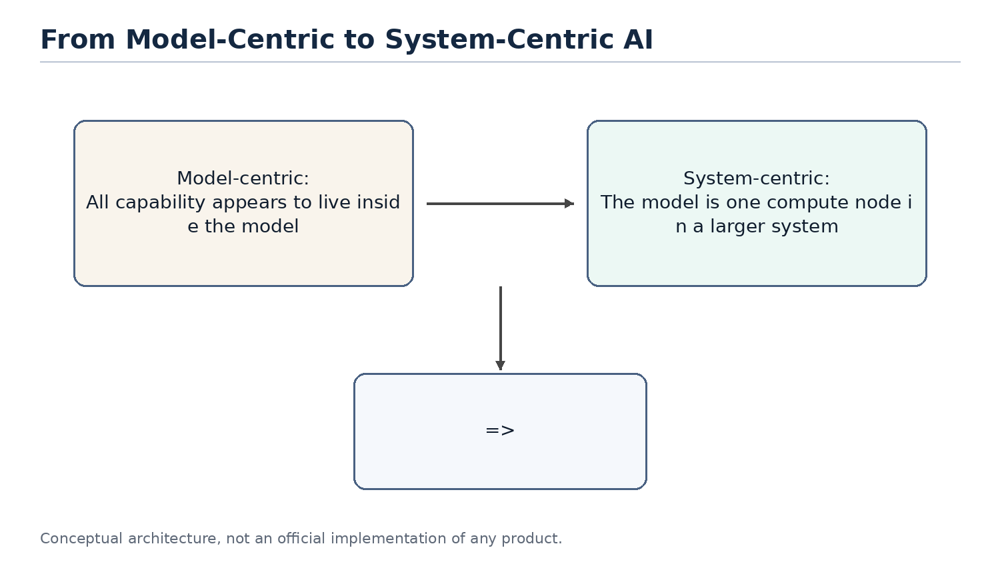

# AI Agent System Design

From Classical Computer Engineering to Modern Agent Architectures - Part I: Chapters 1-6

*Working Draft v0.4 - 2026-06-30*

## Preface

This document is not an API tutorial and not a transcript of a conversation. It is a technical essay written from the perspective of software engineering and distributed systems. Its goal is to explain why modern AI agents increasingly resemble classical computer systems.

The central thesis is simple: LLMs were the breakthrough, but once LLMs are placed inside real products and workflows, the hard problems start to look familiar again. We need to manage state, reduce expensive remote calls, decide what to load into context, route requests to different compute layers, and design systems that remain observable, reliable, and scalable.

Part I completes the first six chapters. Chapter 1 establishes the system-level viewpoint. Chapter 2 reframes the LLM as a compute engine. Chapter 3 explains why an agent is better understood as an orchestrator. Chapter 4 separates the responsibilities of memory, tools and planner. Chapter 5 discusses compute/storage separation. Chapter 6 explains why stateless agents resemble microservice design.

> Core thesis: the LLM is a new compute engine, while the agent is the orchestrator that manages context, tools, state recovery and resource scheduling around it.

## Table of Contents

| Chapter | Title | Status |
| --- | --- | --- |
| Chapter 1 | Why AI Agents Remind Me of Classical Computer Engineering | Complete |
| Chapter 2 | LLM as a New Compute Engine | Complete |
| Chapter 3 | Agent as an Orchestrator | Complete |
| Chapter 4 | Memory, Tools and Planner | Complete |
| Chapter 5 | Compute / Storage Separation | Complete |
| Chapter 6 | Stateless Agents | Complete |
| Chapter 7 | Context Engineering and Query Optimization | Planned |
| Chapter 8 | AGENTS.md as a Prompt Index | Planned |
| Chapter 9 | Retrieval and Context Routing | Planned |
| Chapter 10 | Token Reduction, Distillation and Tiered Compute | Planned |
| Chapter 11 | Agent Production Reliability: Idempotency, State Machines and Replay | Planned |
| Chapter 12 | Multi-Agent, Concurrent Scheduling and Multi-Tenancy | Planned |
| Chapter 13 | Agent Security: Prompt Injection, Sandboxes and Capability Boundaries | Planned |
| Chapter 14 | Toward an Agent Operating System | Planned |

## Terminology

| Term | Meaning in this document | Engineering analogy |
| --- | --- | --- |
| LLM | Large language model used for inference | Compute Engine |
| Agent | System layer that organizes memory, tools, planning and context | Orchestrator / Runtime |
| Memory | Long-term preferences, project context and task state | Database / Cache |
| Context | The working set sent to the model for the current request | Working Set / Buffer Pool |
| Tool | External capability such as files, mail, calendar, GitHub or shell | RPC / API |
| Planner | Component that decomposes tasks, orders steps and decides whether to continue, retry or escalate | Workflow Engine / Scheduler |
| Context Builder | Component that selects the current request's working set from memory, files, tool results and task state | Query Optimizer / Buffer Manager |
| Distillation | Moving capability from a large model to a smaller model or fixed workflow | Precomputation / Tiered Compute |
| Sandbox | An isolated environment that limits an agent's tool, file, network and code execution privileges | OS Process / Container |
| Idempotency | An execution constraint that makes retries safe from duplicate side effects | Payment Idempotency / Exactly-once Boundary |
| Replay | Reconstructing agent execution, tool calls and state transitions for debugging, audit and reconciliation | Event Log / Audit Trail |

Figure 1. The discussion is shifting from model-centric AI to system-centric agent design.
