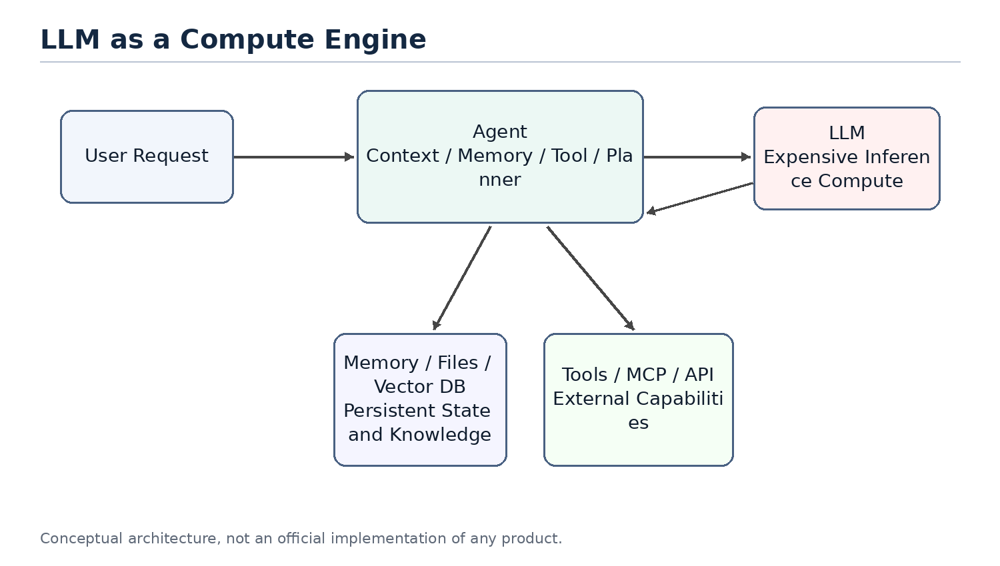
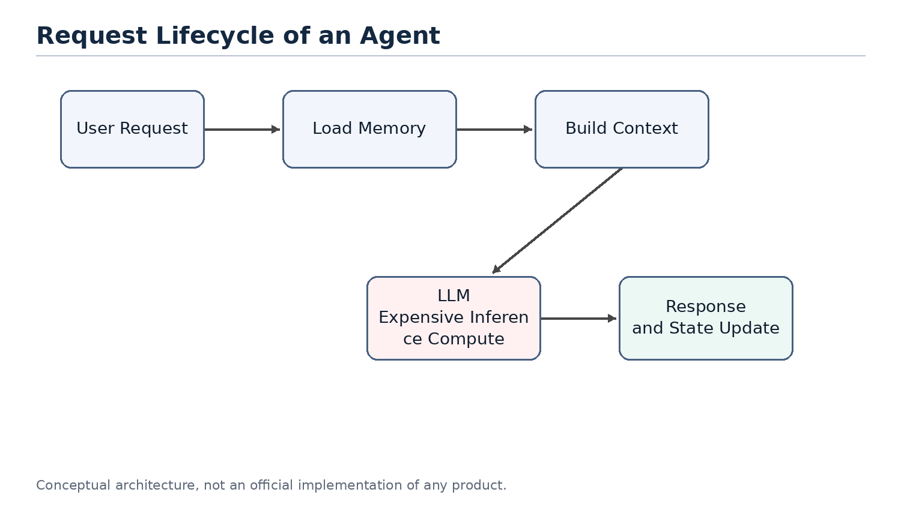

# Chapter 2. LLM as a New Compute Engine

> Chapter focus: position the LLM as a compute node, not as the entire system.



Figure 2. LLM as an expensive compute engine inside an agent system.

## 2.1 The Question

People often mix products such as ChatGPT, Claude or Gemini with the underlying LLM. A product is not just a model. It usually includes a user interface, an agent layer, memory, tool calling, permissions, file handling, monitoring, billing and safety policies. The LLM is only the most important and often the most expensive compute node inside the larger system.

Thinking of the LLM as a compute engine helps clarify agent architecture. The model does not inherently store your long-term memory or your project history. It performs inference based on the context provided in the current request. The agent layer is responsible for recovering state, selecting information and calling tools.

## 2.2 System Role of the LLM

In classical systems, expensive compute services are rarely exposed directly to all business logic without a management layer. Search engines have indexing services. Databases have optimizers. GPU inference clusters may have batching, caching and routing layers in front of them.

LLMs should be understood in a similar way. They can process language, code, reasoning and planning, but that does not mean all state should live inside the model or every task should go directly to the largest model. An LLM is a powerful but expensive remote compute service. Every call consumes input tokens, output tokens, latency and GPU resources.

## 2.3 Stateless Compute

From the perspective of a single inference request, an LLM can mostly be treated as stateless compute. It does not permanently remember a specific user in its weights just because it had a conversation with that user in the previous turn. If the next request does not include the relevant context, the model cannot reliably know what happened before.

This means that when a product appears to remember you, the memory usually comes from the agent layer. The agent retrieves memory, recent conversation, file snippets and tool results, then composes them into the prompt. The model appears to remember because the required state has been restored for that request.



Figure 3. A stateless LLM requires the agent to restore context for each request.

## 2.4 LLM API as an Expensive Remote Call

Calling an LLM API is similar to calling an expensive remote service. It is slower than a local function call, more expensive than most database reads, and less deterministic than traditional APIs. Therefore, a central goal of agent design is reducing unnecessary calls to large models.

This mirrors classical system optimization. We used to reduce cross-service RPC calls, database queries and disk IO. Now we also reduce unnecessary LLM calls, redundant context and repeated reasoning. Tokens, context length, model tier and call count are becoming new performance metrics for AI systems.

## 2.5 Token Cost and Compute Cost Are Not the Same

It is important to distinguish token count from compute cost. This distinction is easy to get wrong. For example, people sometimes say that they want to use distillation to reduce token usage. Strictly speaking, distillation usually does not reduce the number of tokens. It reduces the compute cost of processing the same tokens. A small model and a large model may receive the same number of tokens, but the small model has a lower per-token cost.

The cost of an agent model call can be decomposed with a simple formula:

```text
total cost ~= call count x tokens per call x cost per token
```

These three factors map to different optimization families. Planner limits, cache hits and task merging reduce call count. Context engineering, retrieval, pruning, summarization, prompt caching and compressed tool outputs reduce tokens per call. Distillation, small models, routing and cascades reduce cost per token.

| Dimension | Reducing Token Count | Reducing Per-Token Compute Cost |
| --- | --- | --- |
| Optimization target | Number of input and output tokens per request | Compute and price required to process the same tokens |
| Distributed-systems analogy | Reduce RPCs, shrink payloads and reduce round trips | Move work to a cheaper compute tier, similar to hot/cold tiering or service degradation |
| Typical techniques | Context engineering, RAG, pruning, summarization, prompt caching, compressed tool outputs and planner iteration limits | Distillation, small models, routing and cascades, where a cheap model tries first and uncertain cases escalate |
| Need for training/data | Usually no; engineering and configuration can be enough | Distillation needs labeling, training, evaluation and deployment; routing or existing small models may not |
| Implementation cost and speed | Low cost and fast feedback; prompt, retrieval and cache changes can help immediately | Distillation is high cost; routing is medium cost; benefits depend on stable tasks and evaluation |
| Main risk | Over-pruning loses context and makes the model answer from incomplete information | Wrong-tier routing: simple tasks hit large models and waste money, or hard tasks are sent to weak models and fail |
| Source of uncertainty | Retrieval recall, summarization fidelity and whether tool-output compression damages information | Small-model generalization boundaries and confidence estimation quality |
| Priority for independent developers | Do this first; low barrier and usually no training pipeline | Consider later, after traffic and data become stable; distillation is not the starting move |

Therefore, a more precise statement is that distillation primarily reduces the use of expensive large models, not necessarily the number of tokens. Token usage decreases only when distillation shortens the workflow, reduces repeated planning calls, or replaces several large-model calls with a smaller computation. In that case, the saved tokens come from removed calls and intermediate context, not from distillation directly compressing the tokens inside one request.

This distinction matters in real products. For an independent developer, distillation is a heavy tool: it requires labeled data, a training pipeline, evaluation sets, deployment and model hosting. The token-reduction family looks more like ordinary systems optimization: cache stable prefixes, prune irrelevant context, compress tool outputs, limit planner iterations and avoid unnecessary large-model calls through routing. These can usually work without training.

So if the goal is to reduce cost first, the practical order is usually to exhaust call-count and token-count reductions before moving to routing, small models and distillation. Distillation belongs later, especially for workflows with stable traffic, stable task distributions and enough examples.

## 2.6 Analogy to Classical Compute

As a compute engine, an LLM can be compared to a database execution engine, a remote compute service or a GPU inference cluster. It is powerful, but it should not carry every responsibility in the system. A database does not own business workflow. A CPU does not perform operating-system scheduling by itself. Similarly, an LLM should not be viewed as the entire agent system.

This viewpoint explains why the agent layer matters. The agent does not replace the model; it ensures that the model is called at the right time, with the right context, and at a reasonable cost.

## 2.7 Summary

This chapter positions the LLM as a new high-capability compute engine. It is powerful, expensive, mostly stateless and usually accessed through an API. This explains why memory, context, tools and planning should be viewed as parts of the agent system rather than as properties of the model alone.
