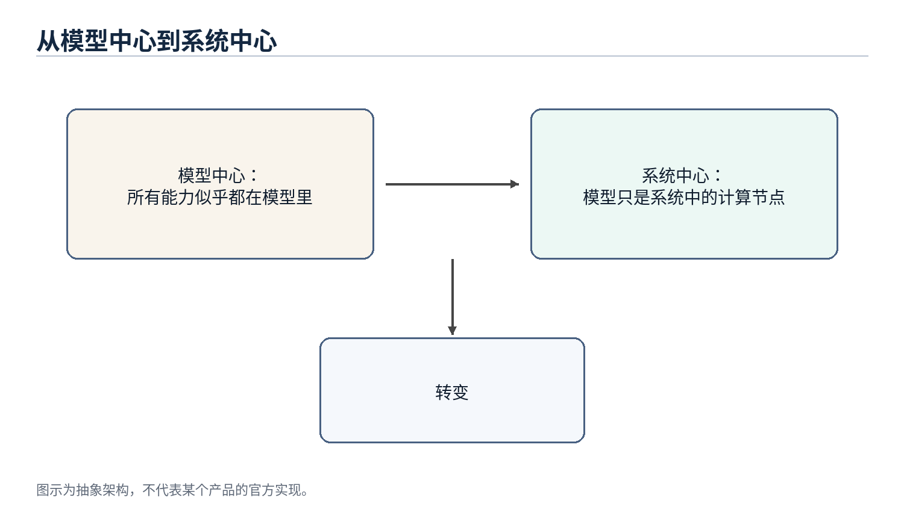

# AI Agent 系统设计

从经典计算机工程到现代智能体架构 - 第一部分：前十三章完整版

*Working Draft v0.7 - 2026-06-30*

## 前言

这份文档不是一份 Agent API 使用手册，也不是一次聊天记录整理。它试图从软件工程师和分布式系统架构师的角度，解释为什么现代 AI Agent 的架构越来越像经典计算机系统。

本文的基本观点是：LLM 是最近几年 AI 的核心突破，但当 LLM 被放进真实产品和真实工作流之后，很多问题又重新回到了计算机工程最熟悉的领域：如何管理状态、如何降低远程调用成本、如何做缓存和索引、如何保持服务无状态、如何在多个计算资源之间调度。

第一部分完成前十三章：第 1 章建立整体视角；第 2 章把 LLM 放回“计算引擎”的位置；第 3 章说明 Agent 为什么更像 Orchestrator；第 4 章拆清 Memory、Tool 与 Planner 的职责边界；第 5 章讨论 Compute / Storage Separation；第 6 章说明 Stateless Agent 为什么接近微服务设计；第 7-8 章进一步讨论 Context Engineering、AGENTS.md（Prompt Index）和 Retrieval / Context Routing；第 9-13 章补上成本、生产可靠性、并发调度、安全和 Agent OS 的整体收束。

> 核心主线：LLM 是新的 Compute Engine，Agent 是围绕它进行上下文管理、工具调用、状态恢复和资源调度的 Orchestrator。

## 目录大纲

| 章节 | 标题 | 状态 |
| --- | --- | --- |
| 第 1 章 | 为什么 AI Agent 让我想到了经典计算机工程 | 已完成 |
| 第 2 章 | LLM：一种新的 Compute Engine | 已完成 |
| 第 3 章 | Agent：为什么它更像 Orchestrator | 已完成 |
| 第 4 章 | Memory、Tool 与 Planner 在 Agent 中的职责 | 已完成 |
| 第 5 章 | Compute / Storage Separation 在 AI 中的体现 | 已完成 |
| 第 6 章 | Stateless Agent 与微服务设计 | 已完成 |
| 第 7 章 | Context Engineering、Prompt Index 与 Query Optimization | 已完成 |
| 第 8 章 | RAG、Retrieval 与 Context Routing | 已完成 |
| 第 9 章 | Token Reduction、Distillation 与 Tiered Compute | 已完成 |
| 第 10 章 | Agent 生产可靠性：幂等、状态机与回放 | 已完成 |
| 第 11 章 | Multi-Agent、并发调度与多租户 | 已完成 |
| 第 12 章 | Agent 安全：Prompt Injection、Sandbox 与权限边界 | 已完成 |
| 第 13 章 | 未来方向：Agent Operating System | 已完成 |

## 术语约定

| 术语 | 本文中的含义 | 工程类比 |
| --- | --- | --- |
| LLM | 大语言模型，负责推理计算 | Compute Engine |
| Agent | 围绕 LLM 组织 Memory、Tool、Planner、Context 的系统层 | Orchestrator / Runtime |
| Memory | 长期保存的用户偏好、项目背景和任务状态 | Database / Cache |
| Context | 本次请求真正送入模型的工作集 | Working Set / Buffer Pool |
| Tool | Agent 可调用的外部能力，例如文件、邮件、日历、GitHub、Shell | RPC / API |
| Planner | 拆解任务、排序步骤并决定是否继续、重试或升级的组件 | Workflow Engine / Scheduler |
| Context Builder | 从 Memory、文件、工具结果和任务状态中选择当前请求 working set 的组件 | Query Optimizer / Buffer Manager |
| Context Routing | 根据任务、权限、状态和成本选择信息源并构造上下文的过程 | Query Planner / Router |
| Prompt Index | 帮助 Agent 以低成本定位项目知识入口的索引结构 | Database Index / Routing Table |
| Distillation | 把大模型能力迁移到小模型或固定工作流 | Precomputation / Tiered Compute |
| Sandbox | 限制 Agent 工具、文件、网络和代码执行权限的隔离环境 | OS Process / Container |
| Idempotency | 保证重试不会重复产生副作用的执行约束 | Payment Idempotency / Exactly-once Boundary |
| Replay | 复现 Agent 执行过程、工具调用和状态变化，用于调试、审计和对账 | Event Log / Audit Trail |
| Scheduler | 在多 Agent、多任务和多租户之间分配资源的系统组件 | OS Scheduler / Resource Manager |
| Capability Boundary | 对工具、资源、操作和参数的显式权限边界 | Permission Model / Capability System |
| Agent OS | 管理 Agent 上下文、工具、状态、调度、安全和可靠性的运行时层 | Operating System / Runtime |

图 1：AI Agent 的讨论正在从模型中心转向系统中心
