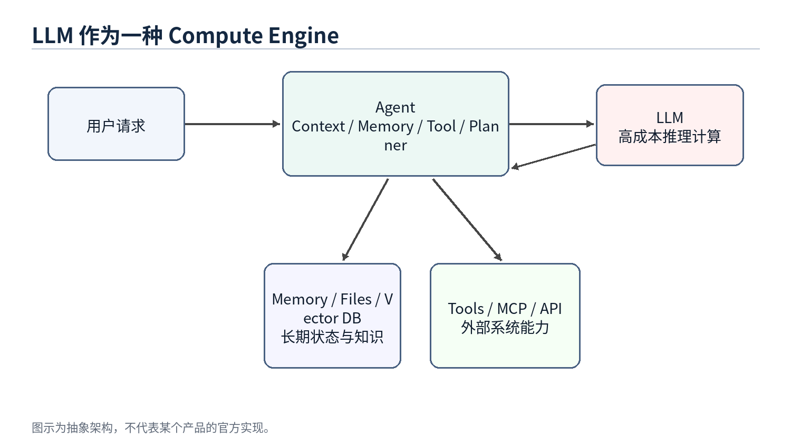
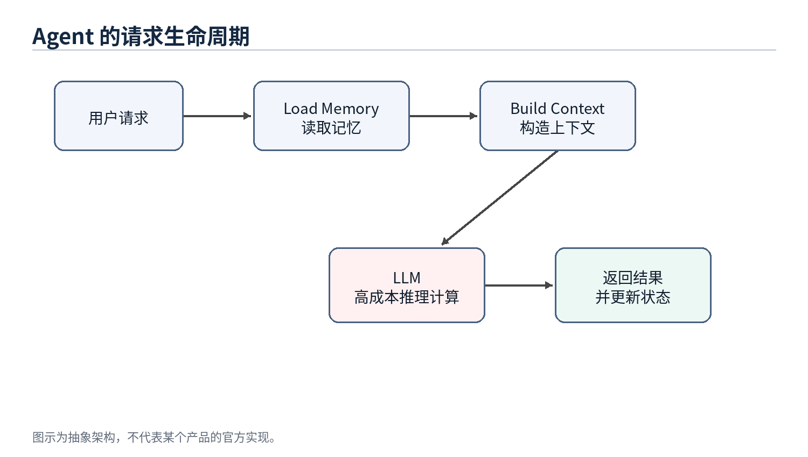

# 第 2 章 LLM：一种新的 Compute Engine

> 本章定位：把 LLM 放回计算节点的位置，而不是把它当成整个系统。



图 2：LLM 作为 Agent 系统中的高成本计算引擎

## 2.1 本章问题

很多人在讨论 AI 系统时会把 ChatGPT、Claude、Gemini 这样的产品和底层 LLM 混在一起。实际上，产品不是模型本身。产品通常包含前端、Agent 层、Memory、工具调用、权限系统、文件系统、监控、计费和安全策略。LLM 只是其中最重要、也最昂贵的计算节点。

把 LLM 看成 Compute Engine，有助于我们重新理解 Agent 架构：模型不负责保存你的长期记忆，也不天然知道你的项目历史；它只是根据本次请求里的上下文进行推理。真正负责恢复状态、选择信息、调用工具的是 Agent 层。

## 2.2 LLM 的系统定位

在传统系统里，一个昂贵的计算服务通常不会直接暴露给所有业务逻辑随意调用，而是会被一层服务封装。比如搜索引擎背后有索引服务，数据库背后有查询优化器，GPU 推理服务前面可能有批处理、缓存和路由。

LLM 也应该这样理解。它可以处理自然语言、代码、推理和规划，但这并不意味着所有状态都应该放进模型，也不意味着所有任务都应该直接调用最大模型。LLM 更像一个非常强但成本很高的远程计算服务。每次调用都会产生输入 token、输出 token、延迟和 GPU 资源消耗。

## 2.3 Stateless Compute：模型本身不保存会话状态

从一次推理请求的角度看，LLM 基本可以被视为 stateless compute。它不会因为上一轮和某个用户聊过，就在模型参数里永久记住这个用户。下一次推理时，如果上下文里没有提供相关信息，模型就无法可靠地知道之前发生过什么。

因此，所谓“模型记住了我”，在多数产品里并不是模型权重发生了个人化更新，而是 Agent 层把 Memory、近期对话、文件片段、工具结果重新拼接进 Prompt。模型看起来像记得，是因为每次请求前都被重新提供了必要状态。



图 3：Stateless LLM 需要 Agent 在每次请求前恢复上下文

## 2.4 LLM API 是一种昂贵的远程调用

从工程成本看，调用 LLM API 很像调用一个昂贵的远程服务。它比普通函数调用慢，比大多数数据库查询贵，而且输出还不是完全确定的。因此 Agent 设计中一个非常核心的目标就是减少不必要的大模型调用。

这与传统系统优化非常类似。以前我们会减少跨服务 RPC、减少数据库查询、减少磁盘 IO；现在我们还要减少无意义的 LLM 调用、减少冗余上下文、减少重复推理。Token、上下文长度、模型层级和调用次数，正在成为 AI 系统新的性能指标。

## 2.5 Token 与 Compute Cost 不是同一个问题

这里需要区分 token 数量和计算成本。这个区分很容易被讲错。比如有人会说“通过模型蒸馏减少 token 使用”，但严格说，蒸馏主要减少的不是 token 数量，而是处理同样 token 所需要的算力成本。一个小模型和一个大模型可能吃进去同样多的 token，但小模型的单 token 成本更低。

可以把 Agent 的模型调用成本拆成一个简单公式：

```text
总成本 ≈ 调用次数 × 单次 token 量 × 单 token 成本
```

这三个因子对应三组不同的优化。Planner、缓存命中和任务合并主要减少调用次数；Context Engineering、RAG、裁剪、摘要、prompt caching 和工具输出压缩主要减少单次 token 量；蒸馏、小模型、路由和级联主要减少单 token 成本。

| 维度 | 降 Token 量 | 降单 Token 算力成本 |
| --- | --- | --- |
| 优化对象 | 每次请求送进和吐出的 token 数 | 处理同样 token 所耗的算力和单价 |
| 分布式类比 | 减少 RPC、缩小 payload、减少往返 | 把任务下沉到更便宜的计算层，例如冷热分层或服务降级 |
| 典型手段 | Context Engineering、RAG、裁剪、摘要、prompt caching、压缩工具输出、planner 迭代上限 | 蒸馏、小模型、路由、级联，先用便宜模型尝试，低置信再升级 |
| 是否需要训练和数据 | 通常不需要，工程和配置即可 | 蒸馏需要标注、训练、评估和部署；路由或现成小模型不一定需要 |
| 落地成本和见效速度 | 低成本、见效快，改 prompt、检索和缓存策略就可能有效 | 蒸馏成本高；路由中等；收益依赖任务稳定性和评估体系 |
| 主要风险 | 裁剪过度导致上下文丢失，模型基于不完整信息回答 | 路由错档，简单任务上大模型会浪费，复杂任务下放小模型会出错 |
| 不确定性来源 | 检索召回质量、摘要保真度、工具输出压缩是否损坏信息 | 小模型泛化边界、置信度估计是否可靠 |
| 独立开发者优先级 | 应该优先做，门槛低，几乎不需要训练管线 | 稳定流量和数据积累之后再考虑，蒸馏不是起手式 |

因此更准确的说法是：蒸馏主要减少对昂贵大模型的使用，而不是必然减少 token。只有当蒸馏让工作流从多次大模型调用变成一次小模型处理，或者减少了多轮规划过程时，token 总量才可能随之下降。此时下降的是被省掉的调用和中间上下文，而不是“蒸馏”直接压缩了每次请求里的 token。

这个区分对真实产品很重要。对独立开发者来说，蒸馏是重武器：需要标注数据、训练管线、评估集、部署和模型托管。相比之下，减少 token 的那组手段更像常规系统优化：缓存稳定前缀、裁剪无关上下文、压缩工具输出、限制 planner 迭代次数、用路由避免无意义的大模型调用。这些通常不需要训练，改工程结构就能见效。

所以如果目标是先把成本降下来，更现实的顺序通常是：先榨干调用次数和 token 量，再考虑路由、小模型和蒸馏。蒸馏适合放在最后，尤其适合那些已经有稳定流量、稳定任务分布和足够样本的工作流。

## 2.6 与传统 Compute 的类比

LLM 作为 Compute Engine，可以类比数据库里的执行引擎、云上的远程计算服务、或者 GPU 推理集群。它的能力强，但不应该承担系统中的所有职责。就像数据库不会负责业务流程，CPU 不会负责操作系统调度，LLM 也不应该被看成整个 Agent 系统本身。

这个视角让我们更容易理解为什么 Agent 层重要。Agent 的任务不是取代模型，而是让模型在正确的时间、拿到正确的上下文、以合理的成本完成计算。

## 2.7 本章小结

本章把 LLM 定位为新的高能力 Compute Engine。它强大、昂贵、基本无状态，并且通过 API 被 Agent 调用。这个定位解释了为什么 Memory、Context、Tool、Planner 等能力不应该被简单归入模型本身，而应该被视为 Agent 系统的组成部分。
